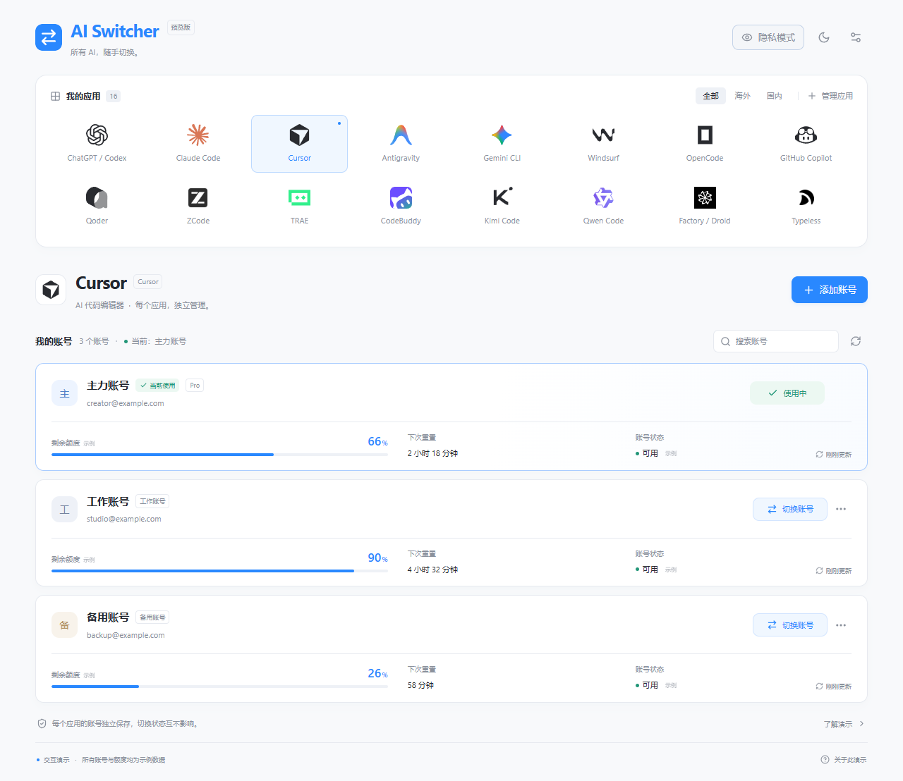
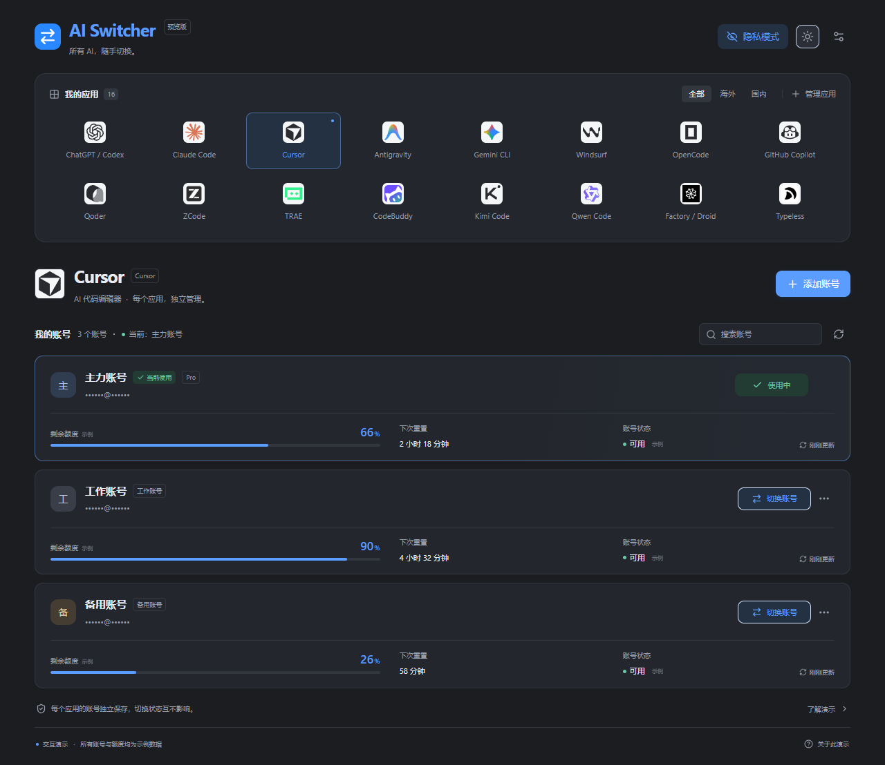

# AI Switcher

**把常用 AI 应用放到一个面板里，每个应用的账号独立管理。**

AI Switcher 展示一种更方便的多应用账号管理体验：顶部选择 Cursor、Claude Code、Qoder 等应用，下方查看该应用的账号卡片、额度和切换入口。

当前仓库提供可运行的交互演示，适合体验产品构想、录制演示视频，以及作为二次开发的界面基础。

> **当前版本是 UI 演示版。** 16 个应用都有可操作的界面，账号、套餐、额度和切换过程使用示例数据。点击“切换账号”会改变演示页面中的当前账号，不会切换真实软件的登录状态。



## 现在能做什么

| 功能 | 实际效果 |
| --- | --- |
| 选择应用 | 点击带品牌图标的应用入口，打开该应用的账号界面 |
| 独立管理账号 | 每个应用默认有主力、工作、备用三个示例账号，切换状态互不影响 |
| 演示账号切换 | 选择目标账号、确认切换、查看分步反馈；过程中可以取消 |
| 添加与移除账号 | 填写展示昵称、可选邮箱和标签；可移除非当前账号，每个应用最多保留 100 个账号 |
| 搜索账号 | 按昵称或展示邮箱筛选；隐私模式下只按昵称搜索 |
| 管理应用列表 | 筛选国内、海外应用，隐藏不常用应用，随时恢复显示 |
| 查看额度卡片 | 展示剩余额度、重置时间与账号状态的设计，数值均为示例 |
| 深浅主题 | 一键切换浅色或深色界面 |
| 录屏隐私模式 | 隐藏展示邮箱，保留账号昵称和操作反馈 |
| 保存与恢复 | 浏览器允许保存时，刷新页面保留账号及设置；损坏缓存按应用恢复默认数据 |
| 重置演示 | 恢复默认示例账号与应用列表，方便重新体验或录屏 |
| 离线使用 | 导出一个独立 HTML 文件，双击打开，无需服务器或联网 |

界面适配桌面及手机浏览器。源码包含缓存恢复测试、浏览器交互核验、构建脚本和 GitHub Actions 配置。

## 有哪些应用界面

| 范围 | 应用 |
| --- | --- |
| 国内 | Qoder、ZCode、TRAE、CodeBuddy、Kimi Code、Qwen Code |
| 海外 | ChatGPT / Codex、Claude Code、Cursor、Antigravity、Gemini CLI、Windsurf、OpenCode、GitHub Copilot、Factory / Droid、Typeless |

这些入口用于展示统一的管理体验。不同产品在真实认证方式、额度规则和账号切换能力上存在差异，后续接入需要分别开发和验证。

## 建议这样体验

1. 打开 Cursor，查看默认的三个示例账号。
2. 将当前账号从“主力账号”切换到“工作账号”，检查确认弹窗、进度和结果。
3. 打开 Qoder，检查它仍使用自己的主力账号；返回 Cursor，检查工作账号状态仍然保留。
4. 添加一个“创作账号”，搜索它，再将它移除。
5. 在“管理应用”中隐藏 ZCode，再重新显示。
6. 开启隐私模式，检查邮箱隐藏；切换深色主题，检查界面显示。
7. 刷新页面，检查设置是否保留；在“演示设置”中重置数据。
8. 打开导出的离线 HTML，重复体验上述操作。



## 当前还没有实现什么

| 能力 | 当前状态 |
| --- | --- |
| 真实账号登录与 OAuth2 授权 | 未接入 |
| 真实应用账号切换 | 未接入，不修改已安装应用的登录状态 |
| 真实额度、套餐及重置时间读取 | 未接入，卡片使用示例数据 |
| 自动选择剩余额度更多的账号 | 未实现 |
| 启动、退出或重启 AI 应用 | 未实现 |
| 云端同步与多设备共享 | 未实现，演示状态只保存在当前浏览器 |
| 凭据加密与账号备份恢复 | 未实现，演示不收集密码或 token |
| 原生桌面安装包 | 本仓库的开源交付为浏览器前端与离线 HTML |

这个版本适合展示和讨论产品体验，也可以作为开发真实账号管理工具的起点。真实接入的开发方向见 [开发路线](docs/开发路线.md)。

## 如何运行

需要 Node.js 22 或更新版本。在源码目录执行：

```sh
npm ci
npm run dev
```

浏览器打开 `http://127.0.0.1:1438`。Windows、macOS、Linux 均可进行前端开发。

### 导出离线演示

```sh
npm run demo:export
```

双击生成的 `demo-release/AI-Switcher-Demo.html`。图标、样式和交互全部内嵌，运行时无需网络。

源码下载本身不包含生成后的 HTML；需要执行导出命令，或使用维护者提供的离线附件。

### 预览构建结果

```sh
npm run demo:serve
```

打开 `http://127.0.0.1:1437`。先执行导出命令生成构建结果，预览服务需要保持运行。

## 数据保存与隐私

演示使用虚构的默认昵称和 `example.com` 邮箱。添加账号仅录入展示文本，请使用示例信息。

设置保存在当前浏览器的 `ai-switcher-demo:v1` 保存项中，不上传服务器，不读取真实应用账号或认证文件。运行时不请求外部图标和统计服务。

隐私模式隐藏页面中的邮箱，**不会加密浏览器保存的数据，也不会隐藏账号昵称**。详细范围见 [安全与数据](SECURITY.md)。

## 开发与验证

项目使用 React、TypeScript、Vite 和 Tailwind，图标组件使用 Lucide。

```sh
npm test
npm run demo:export
npx playwright install chromium
npm run demo:verify
```

单元测试覆盖缓存损坏、缺失字段、越界额度、重复账号和未知应用。浏览器核验覆盖全部应用入口、账号交互、取消切换、持久化、隐私、主题、移动布局、图标及离线 HTML。

浏览器核验自动启动临时服务，结束后关闭。GitHub Actions 配置了 Windows、macOS、Linux 检查，平台执行结果以实际运行记录为准。

代码入口与贡献方式见 [参与开发](CONTRIBUTING.md)。

## 开源交付

完成浏览器核验后执行：

```sh
npm run source:export
```

生成的干净源码目录包含前端代码、图标、文档及构建配置，不包含旧版原生后端、安装脚本或原项目 Git 历史。发布方式见 [发布说明](docs/发布说明.md)。

## 许可证与品牌资源

代码采用 [MIT 许可证](LICENSE)，允许使用、修改和再分发，请保留版权及许可声明。

应用名称与商标属于各自权利人，展示入口不表示获得厂商认证或实现真实接入。图标来自 Lobe Icons 及厂商网站，[来源清单](docs/third-party/demo-logo-sources.json) 与 [Lobe Icons 许可声明](docs/third-party/lobe-icons-LICENSE.txt) 随源码保留。
